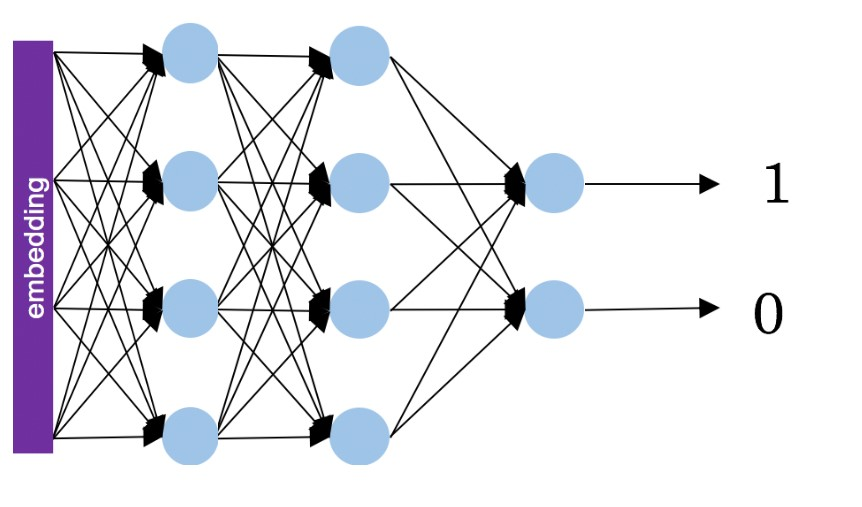

---
language:
- en
tags:
- Natural language processing
- Sentiment classification
- Mood detection
- Tweets analysis
datasets:
- Sentiment140
metrics:
- Accuracy
- Cross entropy loss
results on validation data:
- Accuracy = 0.756
- Cross entropy loss = 0.451
co2_eq_emissions:
- emissions: 1.2g CO2
- source: CodeCarbon
- training_type: pre-training
- geographical_location: Barcelona
- hardware used: 12 CPU (i7-9750H CPU @ 2.60GHz)
---
# TextMood Model Card

For a QuickStart click [here](./doc/gettingStarted.md).

## Table of Contents
- [Model details](#Model-details)
- [Intended use](#Intended-use)
- [Factors](#Factors)
- [Metrics](#Metrics)
- [Training data](#Training-data)
- [Evaluation data](#Evaluation-data)
- [Quantitative analyses](#Quantitative-analyses)
- [Ethical considerations](#Ethical-considerations)

### Model details
* Sentiment classification task with deep neural networks using social networks data
* In particular, detection of users' mood classifying it as positive or negative by simply reading their tweets
* Developed by the TextMood team in the context of TAED II course
* Model date: October 2022
* Model version: 4.0
* Send questions or comments about the model to textmoodupc@gmail.com

### Intended use
* Intended to be strictly used to detect and classify user's mood. It is not allowed to benefit or make a profit from this information.
* Not intended to make judgments about specific users
### Factors
* Subjectivity when evaluating the polarity of the tweet (0 = negative, 1 = positive) may affect the performance and trustworthiness of the model
* The model just evaluates the language. Other factors such as users' race, gender, age or health are not taken into account as the data used are simply tweets extracted by the Twitter API without collecting user's personal information.
### Metrics
* Model trained using tl.CrossEntropyLoss optimized with the trax.optimizers.Adam optimizer
* Tracking the accuracy using tl.Accuracy metric. We also track tl.CrossEntropyLoss on the validation set.
### Training data
* Dataset used: Sentiment140 dataset with 1.6 million tweets https://www.kaggle.com/datasets/kazanova/sentiment140 (80% used for training)
* Tweets preprocessing: Removing stop words, stemming, removing hyperlinks and hashtags (only the sign # from the word) and tokenizing the tweets. Once the tweet is cleaned, we convert it to a tensor (using tweet2tensor function).
* For further information such as dataset description, structure and creation see our Dataset Card: https://github.com/gonzalo-cordova-pou/TextMood/blob/main/DatasetCard.md
### Evaluation data
* Same dataset: Sentiment140 dataset with 1.6 million tweets https://www.kaggle.com/datasets/kazanova/sentiment140 (20% remaining used for testing)
* The same preprocessing steps are applied as we use the same dataset
### Quantitative analyses

All the different versions of our model, alongside with the parameters used and metrics obtained, can be checked in our Comet panel following the next
link: https://www.comet.com/textmood/textmood-co2-tracking/view/new/experiments
### Ethical considerations
* TextMood team follows values such as transparency, privacy, non-discrimination and societal and environmental wellbeing
* As previosuly stated, this model cannot be used for gaining personal or commercial profit by knowing users' mood.
